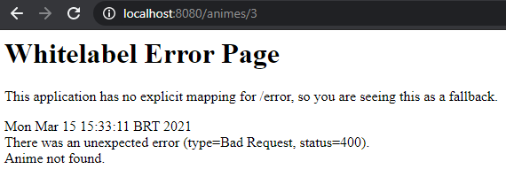
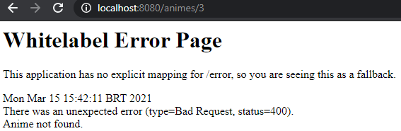
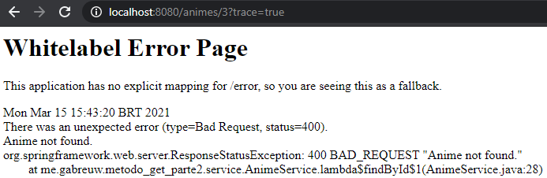

# Método GET parte 2

### Convenções

* ID não encotrado
    * Lançar um ResponseStatusException
        ```java
        @Service
        public class AnimeService {
            private final List<Anime> anime = List.of(
                new Anime(1L, "DB2"),
                new Anime(2L, "Berserk")
            );

            public Anime findById(Long id) {
                return anime.stream()
                    .filter(anime -> anime.getId().equals(id))
                    .findFirst()
                    .orElseThrow(() -> new ResponseStatusException(
                            HttpStatus.BAD_REQUEST,
                            "Anime not found.")
                    );
                    
            }
        }
        ```

### Erros no Front-End

* Não mostrar
    ```yaml
    server:
      error:
        include-stacktrace: never
    ```
    

* Mostrar (on_trace_param) - Deprecated
    ```yaml
    server:
      error:
        include-stacktrace: on_trace_param
    ```
    
    * **PATH**: base_url/id?trace=false
    

    * **PATH**: base_url/id?trace=true
    

* Mostrar (on_param)
    ```yaml
    server:
      error:
        include-stacktrace: on_param
    ```

    * **PATH**: base_url/id?trace=false
      

    * **PATH**: base_url/id?trace=true
      
    